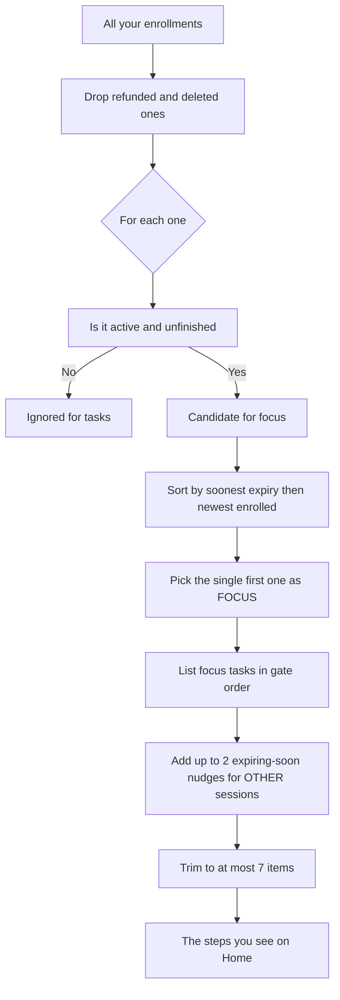
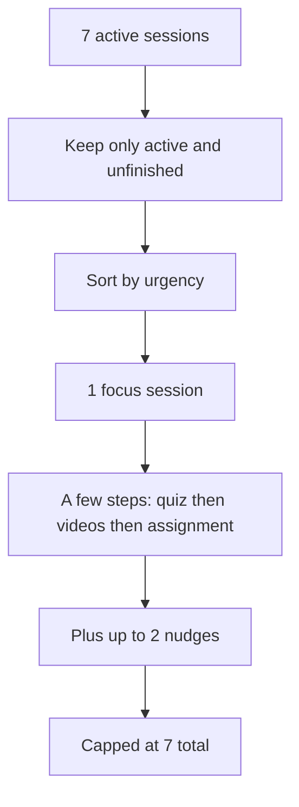
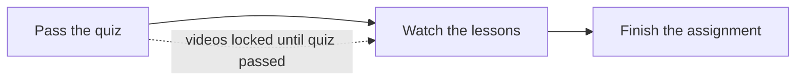

# How your Home plan is decided

## In plain English

Your **Home** screen is a smart, **read-only to-do list**. It does not try to show you everything you are signed up for. Instead, it does the thinking for you and surfaces the **one session that matters most right now** — plus, at most, a nudge or two for anything that is about to run out of time. Think of it like a helpful study buddy who looks at all your courses, picks the single thing you should work on next, and quietly hides everything else so you do not feel overwhelmed. You never tick boxes yourself: every item marks itself done the moment your real progress says so.

If your screen says **"You're all caught up!"** even though you have several sessions, that is not a bug — it means the one session Home chose to focus on has no remaining *unlocked* work to show you. The rest of this document explains exactly how that decision is made, in plain words and pictures.

---

## The big idea: one focus at a time

The whole design of Home is built around a single principle the contract calls **anti-overwhelm**:

> "Anti-overwhelm is structural: at most 7 steps, focus on one session." — the frozen contract, section 0

Most apps would dump a wall of tasks on you: every video in every course, every assignment, every quiz. Home deliberately refuses to do that. It picks **one focus session** and shows you only that session's next moves. When you finish it (or it expires), the plan quietly **rolls forward** to the next one. It is always honest about what is next, and it never pretends you have a deadline you do not actually have.

Two more ideas matter:

- **The plan is *derived*, not stored.** "Derived" just means *computed on the spot from your real progress*. There is no hidden list of checkboxes that someone fills in. Every time Home loads, it re-reads the truth — which videos you have opened, which quiz you have passed, which assignment you have finished — and recalculates the list. You cannot tick a box early, because there are no boxes to tick. The little completion tick you see is a *read-only* result, not a button.
- **The only real deadline is when your access expires.** The app never invents "due in 3 days" labels. The single honest clock is your enrollment's expiry date. That is the only thing that can make a task urgent.

---

## How the plan is built, step by step

Here is the full recipe Home follows every time it builds your plan. Each step is illustrated below.

> **Who sees this plan?** Home is a **student-only** screen. The plan is built from *your own* enrollments, identified from your sign-in — there is no place to type in someone else's id, so you can only ever see your own plan. Signed-out visitors are turned away, and staff accounts are not allowed on this screen at all (they have their own admin views). It is also a pure **read** — looking at your Home plan changes nothing and is not recorded in the audit log.

### (a) Gather your active, unfinished sessions

It collects every session you are enrolled in, **except** refunded ones and deleted ones, newest enrollment first. For each one it works out, from your real data:

- **Is it still active?** A session is *active* if it has not expired yet.
- **Is it unfinished?** A session counts as *incomplete* if **any** of these is true: its **completion state** (worked out from your video progress) is not *Completed*, OR it has a gating quiz you have not passed, OR it has an assignment you have not finished. Note the first leg carefully: a session is *Completed* **only** when every one of its videos has been watched. A session with **zero videos** is always treated as *not started*, so it can never be *Completed* — which means it counts as unfinished no matter what its assignment or quiz says.

> **Important quirk — "watched" and "no videos."** A video counts as *watched* the moment its access counter has been used at least once (the same counter the secure player decrements when you press Play). And here is the subtle part: a session with **zero videos** is treated as **"not started"**, never "complete." So a session that has *no videos* is **always counted as unfinished**, even if you have already done its assignment. This is the single most important fact for understanding your screen — we return to it in the worked example.

### (b) Pick the single most-urgent "focus"

Out of the active *and* unfinished sessions, Home picks exactly **one** to be your focus, using this priority order:

1. Sessions that **have an expiry date** come before sessions with no expiry.
2. Among those, the one that **expires soonest** wins.
3. If two tie, the one you **enrolled in most recently** wins.
4. If still tied, the one **earliest in its prerequisite chain** wins. Concretely: for each candidate, Home counts how many of its *prerequisite ancestors* you are **also enrolled in**, and prefers the one with the fewest — that is, the session that sits nearest the start of the chain you are actually taking, so you tackle prerequisites before the sessions that build on them.

The very first session in that sorted line-up becomes your focus. Everything else steps aside.

### (c) Lay out the focus session's real tasks, in gate order

For your focus session, Home lists only the tasks that actually exist, always in this fixed order:

1. **Pass the quiz** — only if the session has a gating quiz.
2. **Watch the lessons** — only if the session has videos. *(This stays **blocked** — greyed out — until the quiz is passed, because the quiz unlocks the videos.)*
3. **Finish the assignment** — only if the session has an assignment. *(This is never blocked, and you can even finish it after the session expires.)* Once a session expires and is no longer your focus, its assignment does not vanish: if it is still unfinished, it reappears lower down as a **residual "Expired" step** (up to three of them), separate from the main focus — see the all-done / expired path in section (d).

Each task shows as **done** when its real condition is met (quiz passed / all videos watched / assignment marked complete) and **pending** otherwise. If every task that exists is already done, you simply see those done items — and the "Your tasks" panel shows **"You're all caught up!"**

### (d) Add up to 2 "expiring soon" nudges — *only when there is a focus*

This step only runs **if Home actually found a focus session**. When it did, Home then looks for your **other** active, unfinished sessions that expire **within 14 days**, and adds a gentle nudge for up to **two** of them (soonest first). These are reminders, not full task breakdowns.

If there is **no focus at all** (every session is either expired or fully complete), Home skips nudges entirely. Instead it shows a short *residual* list: each expired session whose assignment is still unfinished appears as an **"Expired" assignment step** (up to three), followed by a **Redeem** button — "Renew access" if any expired assignment remains, otherwise "Ready for your next session." If you have no enrollments whatsoever, the list is a single "Redeem a code" step.

### (e) Cap the whole thing at 7

Finally, the combined list is trimmed so it never exceeds **7 items**. Lower-priority items (the nudges, then any leftover items) are dropped first so your focus always survives.

---

## Diagrams

### (i) Decision flowchart — from your enrollments to the steps you see



Plain ASCII version of the same flow:

```
   All your enrollments
            |
   Drop refunded + deleted
            |
   For each one: active AND unfinished?
        |                |
       NO               YES
        |                |
   ignored        candidate for focus
                         |
        Sort: soonest expiry  ->  newest enrolled
                         |
        Pick the FIRST one  =  YOUR FOCUS
                         |
        List its tasks in gate order
                         |
        Add up to 2 "expiring soon" nudges (other sessions)
                         |
        Trim to at most 7 items
                         |
        ====> The steps you see on Home
```

### (ii) The funnel — many enrollments become one focus and a few steps



Plain ASCII funnel:

```
   +-------------------------------+
   |   7 active sessions           |   <- everything you're enrolled in
   +-------------------------------+
                  |
                  v
   +-------------------------+
   |  active AND unfinished  |
   +-------------------------+
                  |
                  v
        +-------------------+
        |   1 focus session |          <- single most urgent
        +-------------------+
                  |
                  v
            +-----------+
            | few steps |               <- only the tasks that exist
            +-----------+
              (max 7 total, incl. <=2 nudges)
```

### (iii) The gate order — quiz unlocks videos, then the assignment



Plain ASCII gate order:

```
  [ Pass the quiz ] --unlocks--> [ Watch the lessons ] --then--> [ Finish the assignment ]
         ^                                   ^                              ^
   only if a quiz                   stays BLOCKED until            never blocked; can be
   gates this session               the quiz is passed             finished even after expiry
```

---

## What each card on the screen means

Every visible element is computed from your real data. Here is the full map, in plain words.

| What you see | What it is | How it is computed |
|---|---|---|
| **Active sessions** (KPI) | A count of your active sessions that are not fully finished | Number of your **active** (not-expired) sessions whose video **completion state is *not Completed***. A session is *Completed* only when it **has videos and every one of them has been watched** — so this count includes sessions with videos still to watch **and** sessions with **no videos at all** (those count as *not started*, never *Completed*). A session whose every video is watched drops out of this count — even if its assignment or quiz is still open — and into **Completed** instead. (It is a *count of sessions*, not a sum of videos.) |
| **Videos watched** N / M (KPI) | How many lessons you have opened vs total | Across your **active** sessions only: N = videos whose access counter has been used at least once; M = total videos in those sessions |
| **Overall progress** % (KPI) | Your average completion | 100 × videos watched ÷ total videos, across **active** sessions (0% if there are no videos) |
| **Completed** (KPI) | Sessions you have finished | Count of **all** your sessions (active or expired) where every video is watched |
| **"Your tasks" panel** | Your live to-do list for the focus session | The focus session's quiz / videos / assignment steps, plus any expiring-soon nudges |
| **"You're all caught up!"** | The friendly empty-state message | Shown when you have activity and there are **no pending tasks left to render**. A generic **Redeem** step that has no deadline (the onboarding "Redeem a code" or the all-done "Ready for your next session") does **not** count as a task — it is surfaced by the hero's "Redeem a code" button instead — so even if such a Redeem step exists in the plan, the list can still read "You're all caught up!" |
| **"COMPLETED · N"** | A small sub-list of finished steps | N = how many of your current steps are already marked done; the list shows those struck-through items |
| **"This week" bar** | Your progress through this week's steps | 100 × completed steps ÷ total steps; caption reads "N of M done tasks" |
| **"Recently enrolled" rail** | Your newest sign-ups | Your **5 most recent** enrollments, newest first — completely independent of the task list |

---

## Worked example: your exact screen, explained

Here is your actual Home screen, walked through line by line, with the precise reason for each number.

**Your KPI cards:**
- **Active sessions: 7** — all **7** of your active (non-expired) sessions are counted here, because none of them is fully video-complete: each one either still has unwatched videos or — like your Algebra focus — has **no videos at all** (which counts as *not started*, never *Completed*). If any active session had every video watched, it would drop out of this count and into **Completed** instead.
- **Videos watched: 4 / 9** — across those active sessions there are 9 videos total, and you have opened 4 of them at least once.
- **Overall progress: 44%** — that is 4 ÷ 9, rounded.
- **Completed: 2** — 2 of your sessions have every video watched, so they count as fully complete.

**Your "Your tasks" panel says: "You're all caught up!"** with one struck-through **"Finish your assignment"** item tagged **[Assignment] [Algebra]** under **"COMPLETED · 1"**. **"This week"** shows **100%**, "1 of 1 done tasks."

### Why does this happen with 7 active sessions?

The key is **which session became your focus** and **what tasks it could show you**.

1. **Home picked one focus.** All 7 of your active sessions are *unfinished* — including the Algebra one, which has **zero videos** and so can never be marked "Completed." From those, exactly one was chosen as the focus by the urgency rules (soonest expiry, then newest enrolled). In your case that focus is an **Algebra** session.

2. **That focus session has no videos, but a completed assignment.** Here is the crucial mechanism, confirmed in the code:
   - A session with **zero videos** is always treated as **"not started,"** never "complete." So even though you finished its assignment, the session is still flagged **unfinished** — which is exactly why it was *eligible* to be the focus in the first place.
   - When Home then lists the focus session's tasks, it adds a task **only if that task exists**. No quiz → no quiz step. **No videos → no "watch lessons" step.** It does have an assignment, and you finished it → so the **only** step it can produce is the **completed** "Finish your assignment" item.

3. **So the task list contains exactly one step, and that step is already done.** That is why:
   - The **"COMPLETED · 1"** sub-list shows your one finished Algebra assignment.
   - There are **zero pending tasks**, so the panel switches to the **"You're all caught up!"** message.
   - **"This week"** reads **100%** — 1 of 1 steps done.

4. **The other 6 sessions and their 5 unwatched videos are simply not shown here.** Home is single-focus by design. Those other sessions only appear as tasks if one of them becomes your most-urgent unfinished focus, or if one is expiring within 14 days (an "expiring soon" nudge). Neither was true, so none of them produced a task. The 5 unwatched videos are still counted in your **KPI cards** (that is why "Videos watched" shows 4 / 9) — they just are not in your *to-do list*.

In short: **your screen is correct and reassuring.** The one session Home is steering you toward has no locked-up work left to do, so it is telling you, honestly, that there is nothing pending right now.

### And why didn't enrolling a brand-new session add a task?

Because enrolling a new session did **not** change which session is the most-urgent unfinished one. The new session is not expiring within 14 days and it is not the soonest-to-expire active session, so the focus picker kept choosing the same Algebra session it picked before. The plan recomputed — and produced the same answer. (Your new session **did** show up — see the next section.)

---

## Why my new session isn't a task (and where it DID show up)

**Q: I just enrolled in a new session. Why isn't it in "Your tasks"?**
Because "Your tasks" only ever shows your **single most-urgent unfinished focus** plus up to **2 "expiring soon" nudges**. A brand-new enrollment usually has plenty of time left, so it is neither the soonest-to-expire focus nor an expiring-soon nudge. It is real and counted — just not your *next* thing to do.

**Q: So where is it?**
It is in the **"Recently enrolled"** rail at the bottom — that is exactly what you saw ("5C Wiring 100047," "Calculus Starter," "Algebra Practice," the two S4 LaTeX demos, all "Added today"). That rail lists your 5 newest enrollments, completely independently of the task logic, so a new sign-up always appears there immediately.

**Q: When will it become a task?**
When **either** of these becomes true:
- It becomes your **most-urgent unfinished session** — which happens once your current focus is finished or expires and the plan **rolls forward**; or
- It starts **expiring within 14 days**, at which point it can appear as an "expiring soon" nudge.

**Q: Will finishing or losing my current focus surface the next one?**
Yes. The plan is a rolling, current-frontier list. Complete (or let expire) the session that is currently your focus, and the next-most-urgent unfinished session automatically takes its place with its own tasks.

---

## About the cache (why clearing Redis didn't change anything)

To stay fast, Home **remembers** your computed plan for the week instead of rebuilding it on every visit. "Cache" just means *a saved copy kept for speed*. There are two layers:

- **A shared saved copy (Redis / "L2").** This is the copy you manually cleared. Clearing it does **not** change your plan — it only forces Home to **recompute** the next time it is asked.
- **A brief in-memory copy (per server, "L1"), kept for exactly 60 seconds.** Each running server also holds its own short-lived copy. If you clear the shared Redis copy but ask again within that 60-second window, the server may still answer from this in-memory copy and not even look at Redis yet. (On a multi-server setup this is why one server can briefly keep serving the old plan for up to a minute after another server's copy was already cleared — it self-corrects when the 60 seconds lapse.)

> **The saved copy is labelled per student, per week.** Behind the scenes each saved plan is filed under a key like `plan:{tenant}:{student}:{week}` — for example `plan:abc-123:xyz-789:2026-W25`. Two things matter about that label. First, your **tenant** (which school/teacher you belong to) is part of it, so plans can never leak between tenants. Second, although the *key* names one specific week, the copy is **tagged with just your student id** (`plan:{student}`). That tag is what lets the system throw away **all** of your cached weeks in one go whenever your real progress changes — it never needs to know which week is current.

> **There is also a minimum lifetime of 5 minutes.** A saved plan normally lives until the end of the ISO week (so it naturally rolls over each Monday). But if you happen to load Home in the last few seconds before the week ends, the copy is still kept for at least **5 minutes** rather than for a sliver of a second. This floor avoids pointless rebuilding right on the week boundary.

So clearing Redis did one of two things — and **both lead to the same screen**:

1. The server answered from its 60-second in-memory copy, so nothing was recomputed yet; or
2. The server recomputed the plan from scratch — **but the rules picked the same focus**, so the recomputed plan looks identical.

This is the important point: **clearing the saved copy cannot change the *answer*, only how it is produced.** The focus-selection rules are deterministic. Adding a new, non-urgent session does not change who the most-urgent unfinished session is, so a fresh computation produces the same focus and therefore the same task list.

**What actually refreshes your plan (verified in the code):** the saved copy is automatically thrown away ("invalidated") whenever your real state changes — when you enroll or your enrollment is extended or refunded, when a quiz is graded, when an assignment is graded, when you spend a video view, and even on a partial assignment answer. Enrolling your new session **did** trigger this invalidation. But invalidation only forces a recompute; it does not change the rules. The recompute still picked the same Algebra focus, so your "Your tasks" stayed the same — which is correct.

---

## Glossary

- **Focus session** — the single most-urgent, still-active, still-unfinished session that Home is steering you toward right now.
- **Gate** — a lock between steps. The main one: a session's videos stay locked until you pass its gating quiz.
- **Expiry** — the date your access to a session ends. It is the only real deadline the app uses.
- **Derived** — computed on the spot from your real progress, not stored or manually edited. Your task ticks are results, not buttons.
- **Completion state** — a session is *Completed* only when **every** video has been watched, *Not started* when none has, and *In progress* in between. A session with **no videos** is always *Not started* (never *Completed*).
- **Residual / "Expired" step** — when no active session is your focus, Home still surfaces any **expired** session whose assignment you have not finished, shown as an "Expired" step you can still complete (up to three), followed by a Redeem button.
- **Soft-deleted / "deleted"** — removed rows the system keeps for history but hides from you. The plan quietly skips refunded enrollments and any session or enrollment that has been deleted, so they never appear as tasks.
- **KPI** — "key performance indicator," the four summary number cards at the top (active sessions, videos watched, overall progress, completed).

---

*This document describes the behaviour implemented as of 2026-06-22. The plan rules and cache live in `GetMyPlanHandler.cs`; the "Redeem isn't a task" / "all caught up" rendering lives in the student-portal `home.component.ts`; the student-only access gate is in `MeHomeEndpoints.cs`; and the cache-invalidation seam is `IStudentPlanCache` / `StudentPlanCacheInvalidationHandler.cs`. If the rules change, update this doc. For the authoritative specification, see the frozen contract at `docs/contracts/student-home-weekly-plan.md`.*
